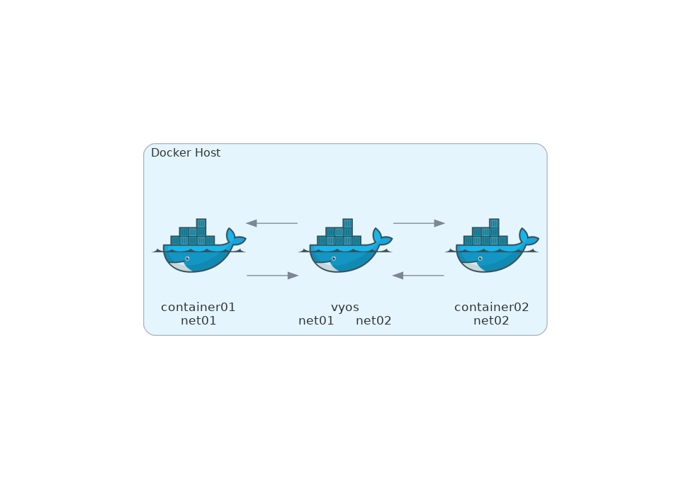

# Routing among different docker networks on the same host machine

## Description

Docker networks are not designed to route between each other, but you can connect a container to multiple networks.

## Examples

- Container01 belongs to the network net01.
- Container02 belongs to the network net02.
- VyOS container belongs to both net01 and net02.
- To route packets between container01 and container02
  - Add static routes on both container01 and container02.



## How to build a VyOS container image

See [Deploy container from ISO](https://docs.vyos.io/en/latest/installation/virtual/docker.html#deploy-container-from-iso)

## Walkthrough

Asuuming you arelady have a VyOS cotainer image.
```text
$ docker images |grep ^vyos|awk '{print $1}'
vyos-1.5-rolling-202310030022
```

<br>You can find a sample compose file at [compose file](docker-compose.yml)
<br>Change a VyOS image name to suit your environment.

<br>Build and start containers.
```text
docker-compose build
```

```text
docker-compose up -d
```

```text
$ docker exec a-c01 ip -4 a s eth0|grep inet
    inet 10.0.0.10/24 brd 10.0.0.255 scope global eth0
```

```text
$ docker exec a-c02 ip -4 a s eth0|grep inet
    inet 192.168.100.10/24 brd 192.168.100.255 scope global eth0
```

```text
$ docker exec a-vyos ip a |grep inet|grep -v 127.0.0.1
    inet 192.168.100.200/24 brd 192.168.100.255 scope global eth1
    inet 10.0.0.200/24 brd 10.0.0.255 scope global eth0
```

<br>For example, to route packets from container01 to container02, you would add the following static route to container01:
```text
docker exec a-c01 ip route add 192.168.100.0/24 via 10.0.0.200
```
where 192.168.100.0/24 is the subnet of net02 and 10.0.0.200 is the IP address of the VyOS container.<br>

Similarly, to route packets from container02 to container01, you would add the following static route to container02:
```text
docker exec a-c02 ip route add 10.0.0.0/24 via 192.168.100.200
```

where 10.0.0.0/24 is the subnet of net01 and 192.168.100.200 is the IP address of the VyOS container.<br>


Once you have added the static routes to container01 and container02, you will be able to route packets between the two containers.
```text
$ docker exec a-c01 ping -c1 192.168.100.10
PING 192.168.100.10 (192.168.100.10) 56(84) bytes of data.
64 bytes from 192.168.100.10: icmp_seq=1 ttl=63 time=0.157 ms

--- 192.168.100.10 ping statistics ---
1 packets transmitted, 1 received, 0% packet loss, time 0ms
rtt min/avg/max/mdev = 0.157/0.157/0.157/0.000 ms
```
